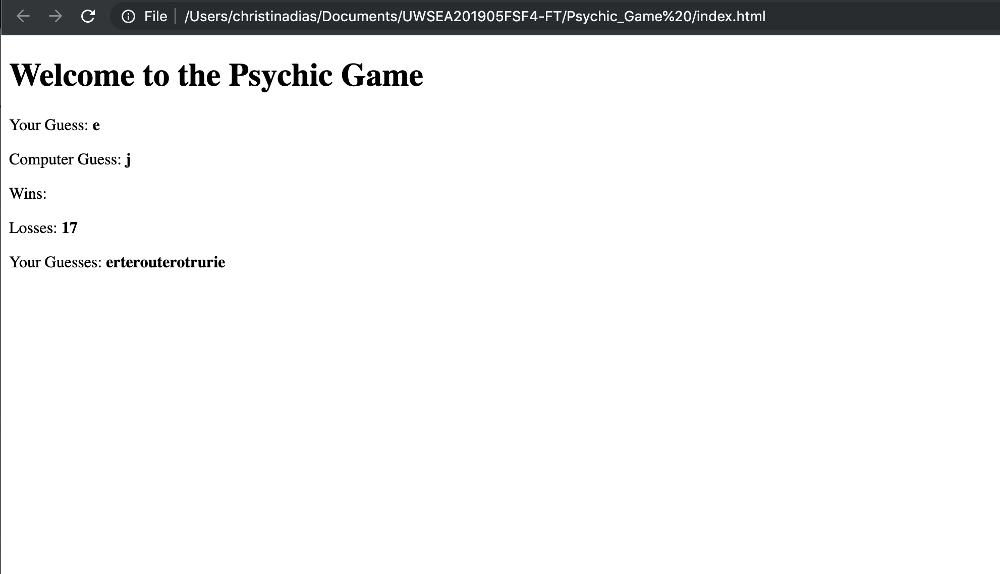

# Psychic_Game

# Overview 

* The app randomly picks a letter, and the user has to guess which letter the app chooses.

These are the functions that the app has:
- Randomizes a letter the computer is thinking of
- Displays the letter that the player guesses
- Displays Wins: (# of times the user has guessed the letter correctly)
- Displays Losses: (# of times the user has failed to guess the letter correctly after exhausting all guesses

This game uses: 
- Javascript 
